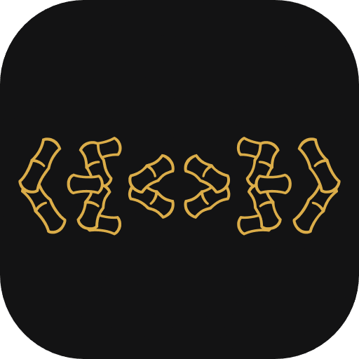
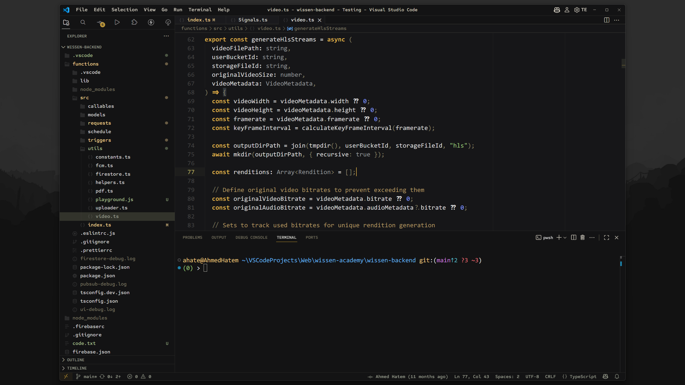
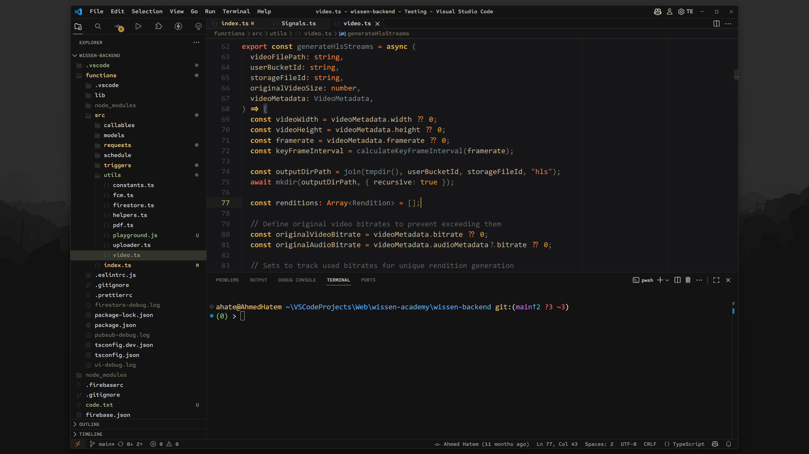
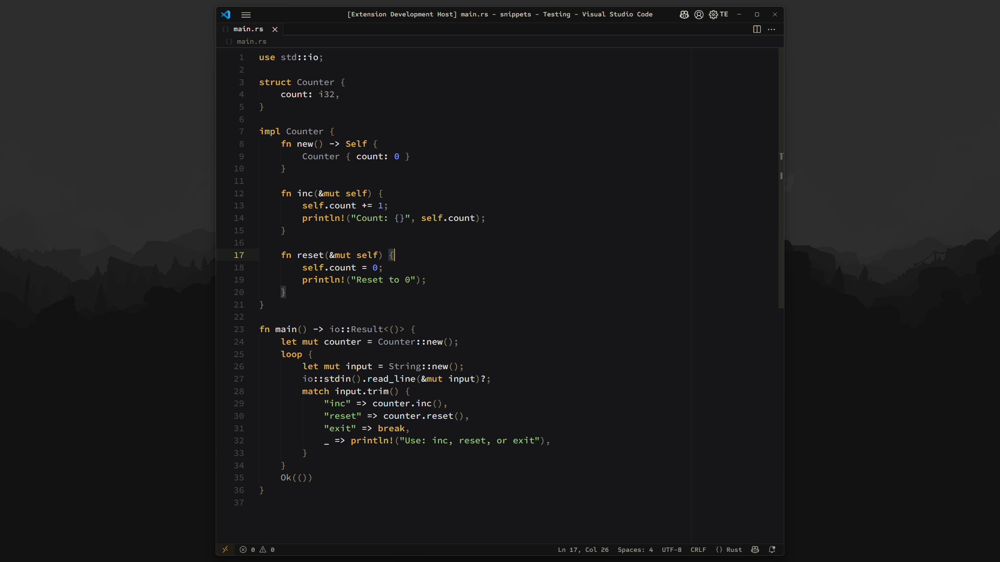
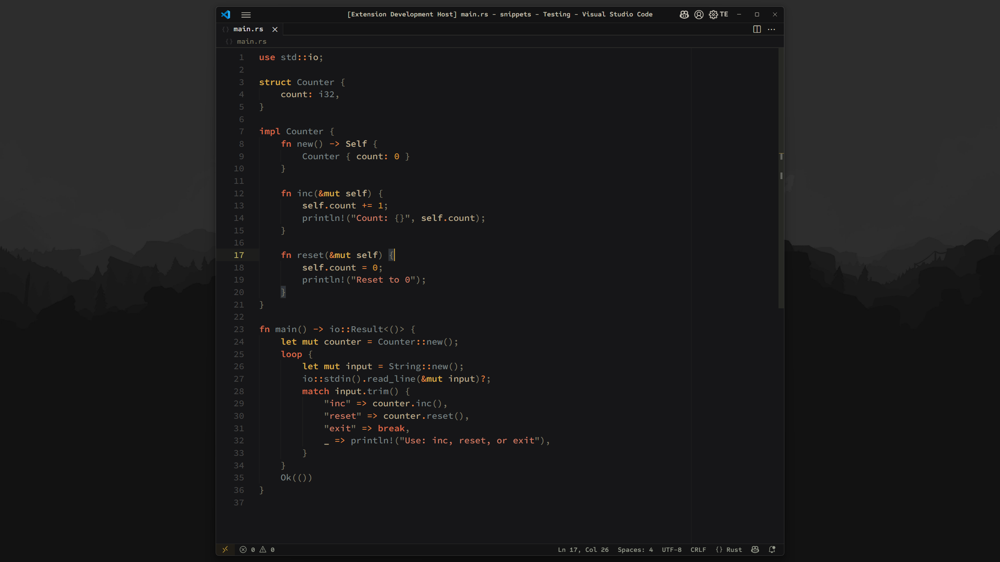
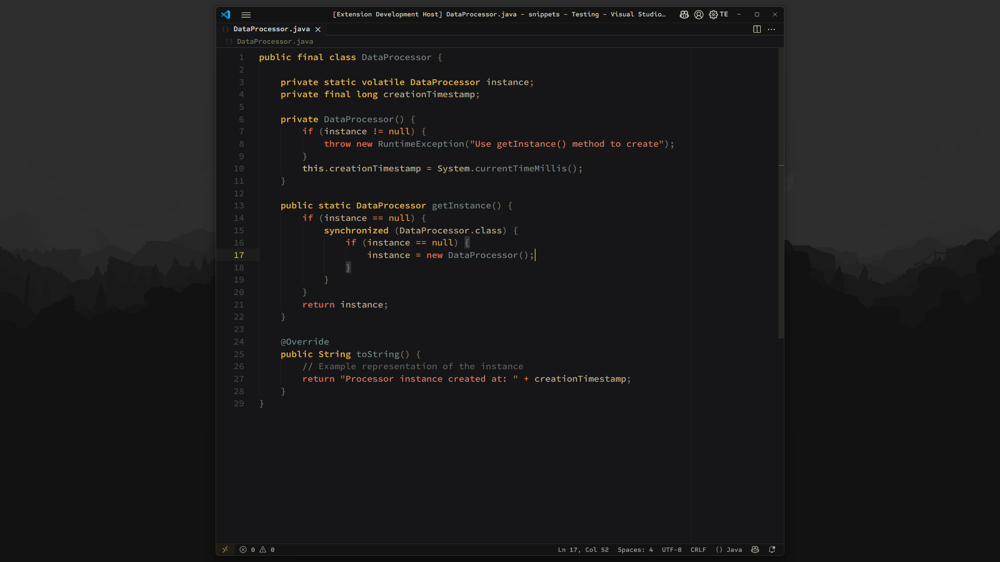
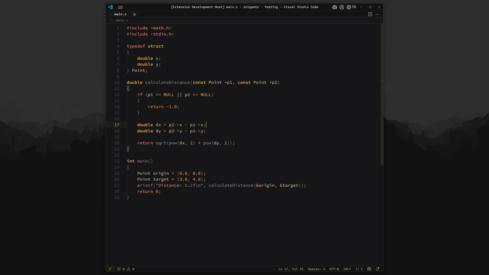
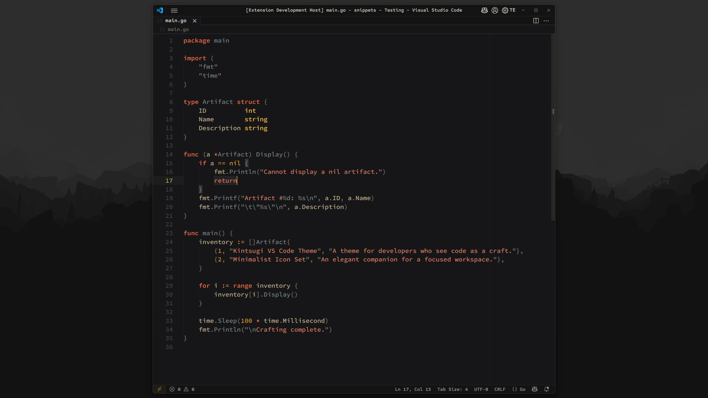

<div align="center">
  
  <h1>Kintsugi</h1>
  <p>A sophisticated dark theme for the discerning developer, lovingly inspired by Japanese philosophy and minimalist aesthetics.</p>
</div>

<div align="center">

[](https://marketplace.visualstudio.com/items?itemName=ahmedhatem.kintsugi)
[](https://marketplace.visualstudio.com/items?itemName=ahmedhatem.kintsugi)

</div>

---

### Why Kintsugi?

This theme is inspired by **Kintsugi (金継ぎ)**, the Japanese art of repairing broken pottery with gold-dusted lacquer. It celebrates imperfections as part of an object's unique history. Kintsugi applies this philosophy to your workspace, creating a serene, focused environment where code is the masterpiece and the UI serves it with calm, beautiful utility.

**This is a theme for developers who see code as a craft.**

---

## The Variants

Kintsugi offers two distinct, meticulously crafted variants to match your mood and focus. Both share the same seamless, minimalist UI, but offer a different syntax highlighting experience.

### Kintsugi Dark (The Original)

_The original experience. A calm, minimalist palette with soft, desaturated colors and bold, gilded keywords. It is designed for absolute focus and clarity._



### Kintsugi Dark Flared

_The warm variant. A vibrant, cozy palette inspired by autumn and campfires. It features rich oranges, terracotta, and deep golds, creating an expressive and comfortable environment for long coding sessions._



---

## Language Showcase

See how Kintsugi's syntax brings clarity and elegance to your favorite languages.

### Kintsugi Dark

|                              Rust                               |                              Java                               |
| :-------------------------------------------------------------: | :-------------------------------------------------------------: |
|  |  |
|                              **C**                              |                             **Go**                              |
|     |    |

### Kintsugi Dark Flared

|                                 Rust                                 |                                 Java                                 |
| :------------------------------------------------------------------: | :------------------------------------------------------------------: |
|  |  |
|                                **C**                                 |                                **Go**                                |
|        |      |

---

## How to Get the Look from the Screenshots

To replicate the exact, polished aesthetic from the showcase, follow these three steps.

### Step 1: Theme, Font & Icons (The Foundation)

First, install the core components.

1.  **Install Kintsugi Theme:** Install the theme from the [VS Code Marketplace](https://marketplace.visualstudio.com/items?itemName=ahmedhatem.kintsugi).
2.  **Install the Font:** Download and install [**Hasklig**](https://github.com/i-tu/Hasklig), the free font used for the editor.
3.  **Install the Icons:**
    - File Icons: [**Quill Icons**](https://marketplace.visualstudio.com/items?itemName=cdonohue.quill-icons) (minimalist, as seen in screenshots)
    - Product Icons: [**JetBrains Product Icon Theme**](https://marketplace.visualstudio.com/items?itemName=fogio.jetbrains-product-icon-theme) (clean, unified UI icons)

### Step 2: The Core Settings

Next, paste these settings into your `settings.json` (`Code > Preferences > Settings > Open Settings (JSON)`). These enable the seamless UI and minimalist features of the theme.

```json
{
  "workbench.colorTheme": "Kintsugi Dark",
  "workbench.iconTheme": "quill-icons",
  "workbench.productIconTheme": "jetbrains-product-icon-theme",
  "editor.fontFamily": "Hasklig", // Or Consolas (both in screenshots)
  "editor.fontLigatures": true,
  "editor.fontSize": 16,
  "editor.fontWeight": "500",
  "window.zoomLevel": 2,

  // Essential for the clean, minimalist look
  "editor.padding.top": 5,
  "window.commandCenter": false,
  "workbench.editor.empty.hint": "hidden",
  "workbench.tree.indent": 20,
  "window.density.editorTabHeight": "compact",
  "workbench.layoutControl.enabled": false,
  "editor.cursorSmoothCaretAnimation": "on",
  "editor.minimap.enabled": false
}
```

### Step 3: The Final Polish (Advanced Customization)

This step is **required** to achieve the exact look from the screenshots. It uses the [**Custom UI Style**](https://marketplace.visualstudio.com/items?itemName=subframe7536.custom-ui-style) extension to apply two key refinements:

1. Changes the UI font (File Explorer, menus, etc.) to [**Sometype Mono**](https://monospacedfont.com/). You must download and install this font.
2. Refines keyword boldness with a subtle `font-weight` for a softer, elegant appearance.

<details>
  <summary><strong>Click to see the advanced CSS settings</strong></summary>

Add the following to your `settings.json`:

```json
{
  "custom-ui-style.font.sansSerif": "Sometype Mono Semibold",
  "custom-ui-style.stylesheet": {
    ".composite-bar": {
      "width": "100%"
    },
    ".monaco-action-bar .actions-container": {
      "justify-content": "space-between"
    },
    ".mtkb": {
      "font-weight": "700 !important"
    }
  }
}
```

**For vibrant icon packs:** To align colorful icons (e.g., Bearded Icons) with Kintsugi's minimalist palette, add this to the `custom-ui-style.stylesheet`:

```json
".monaco-icon-label:before": {
  "filter": "grayscale(1) brightness(0.7) !important"
}
```

</details>

---

## Further Customization Options

<details>
  <summary><strong>Alternative Font Recommendations</strong></summary>

- **[Consolas](https://github.com/somq/consolas-ligaturized)**: A classic monospaced font with ligatures for enhanced coding aesthetics.
- **[Iosevka](https://typeof.net/Iosevka/)**: A highly customizable, monospaced font with a sleek, modern design and extensive ligature support.
- **[M PLUS Code Latin Expanded](https://mplusfonts.github.io/)**: A clean, modern, monospaced font with excellent legibility.
- **[Lilex](https://github.com/mishamyrt/Lilex)**: An extended IBM Plex Mono with ligatures.
- **[JetBrains Mono](https://www.jetbrains.com/lp/mono/)**: A popular font designed for developers.

</details>

<details>
  <summary><strong>Complete `settings.json` from the Screenshots</strong></summary>

This is the full configuration used in the screenshots:

```json
{
  "editor.fontFamily": "Hasklig", // Or Consolas (both in screenshots)
  "editor.fontSize": 16,
  "editor.fontWeight": "500",
  "workbench.colorTheme": "Kintsugi Dark Flared",
  "workbench.iconTheme": "quill-icons",
  "workbench.productIconTheme": "jetbrains-product-icon-theme",
  "editor.cursorSmoothCaretAnimation": "on",
  "window.zoomLevel": 2,
  "editor.padding.top": 5,
  "window.commandCenter": false,
  "workbench.editor.empty.hint": "hidden",
  "workbench.tree.indent": 20,
  "window.density.editorTabHeight": "compact",
  "workbench.layoutControl.enabled": false,
  "editor.minimap.enabled": false,
  "workbench.tree.enableStickyScroll": false,
  "editor.stickyScroll.enabled": false,
  "editor.renderLineHighlight": "gutter",
  "editor.overviewRulerBorder": false,
  "editor.guides.bracketPairs": false,
  "editor.bracketPairColorization.enabled": false,
  "editor.scrollbar.horizontalScrollbarSize": 6,
  "editor.scrollbar.verticalScrollbarSize": 10,
  "editor.wordWrap": "on",
  "editor.wrappingIndent": "indent",
  "editor.cursorBlinking": "solid",
  "editor.accessibilitySupport": "off",
  "editor.inlayHints.enabled": "offUnlessPressed",
  "editor.smoothScrolling": true,
  "editor.tabSize": 4,
  "editor.insertSpaces": true,
  "editor.renderWhitespace": "selection",
  "workbench.editor.tabSizing": "fit",
  "workbench.activityBar.location": "top",
  "editor.cursorSurroundingLines": 1000,
  "editor.rulers": [80, 100, 120]
}
```

</details>

<details>
  <summary><strong>Optional Zen Mode Configuration</strong></summary>

For a minimalist, distraction-free experience, add these settings to your `settings.json`:

```json
{
  "workbench.statusBar.visible": false,
  "breadcrumbs.enabled": false,
  "workbench.editor.showTabs": "none",
  "workbench.activityBar.location": "hidden",
  "editor.lineNumbers": "off",
  "editor.glyphMargin": false
}
```

</details>

---

## Issues & Contributing

Found a bug or have a suggestion? Please [open an issue](https://github.com/ahmedhatem/vscode-kintsugi/issues) on GitHub. Contributions and feedback are welcome to make Kintsugi even better.

This project is a labor of love, and I’m excited to see how the community shapes it.

## Installation

1. Open the **Extensions** sidebar in VS Code (`View > Extensions`).
2. Search for `Kintsugi`.
3. Click **Install**.
4. Go to `Code > Preferences > Color Theme` and select **Kintsugi Dark** or **Kintsugi Dark Flared**.

## Acknowledgements

Kintsugi was built with inspiration from exceptional themes:

- **Kintsugi Dark**: Inspired by [**Owokai** by toiletbril](https://github.com/toiletbril/Owokai).
- **Kintsugi Dark Flared**: Draws from the vibrant syntax of [**Flare Theme** by Pyxel](https://marketplace.visualstudio.com/items?itemName=pyxel.flare-theme).

---

**[View Changelog](./CHANGELOG.md)**
