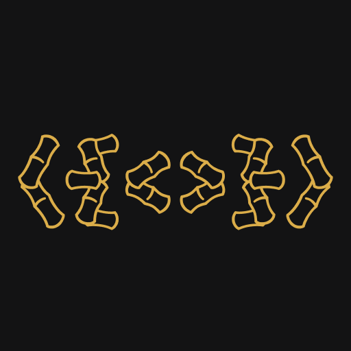
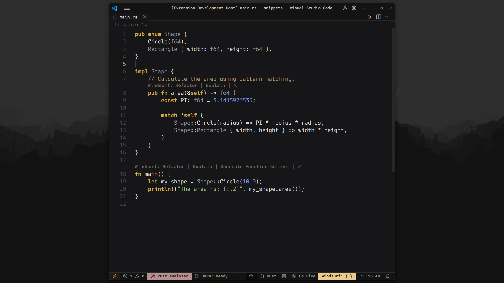
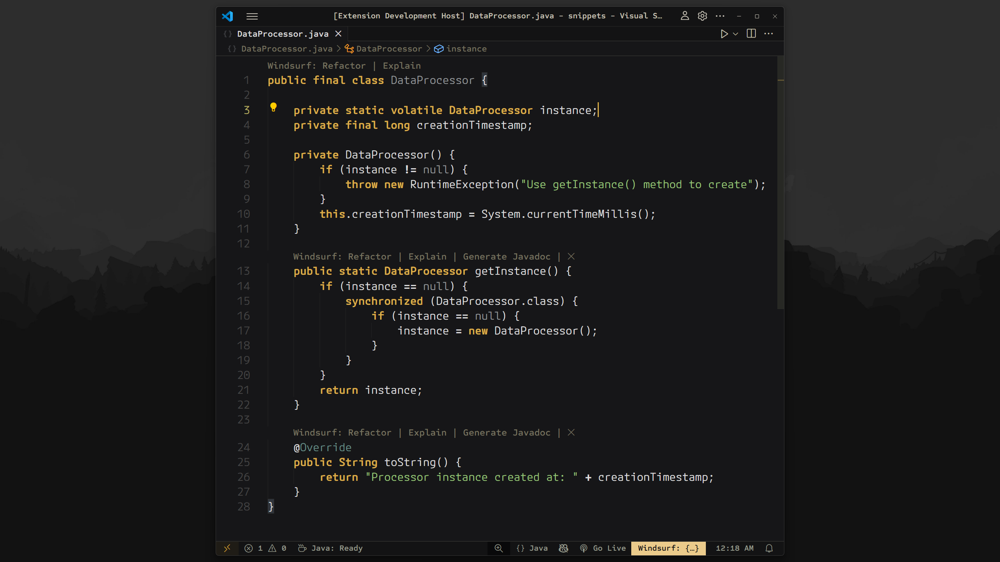
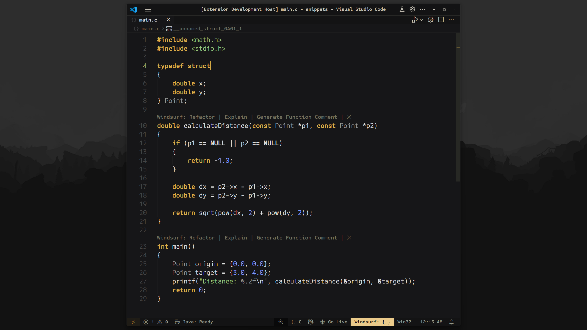
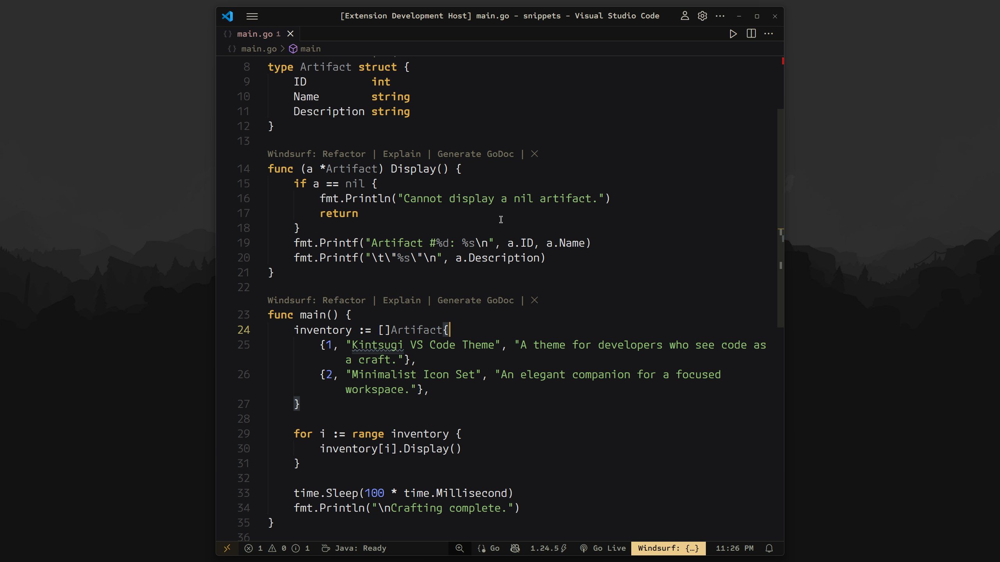

<div align="center">
  
  <h1>Kintsugi</h1>
  <p>A sophisticated dark theme for the discerning developer, lovingly inspired by Japanese philosophy and minimalist aesthetics.</p>
</div>

<div align="center">

[](https://marketplace.visualstudio.com/items?itemName=ahmedhatem.kintsugi)
[](https://marketplace.visualstudio.com/items?itemName=ahmedhatem.kintsugi)

</div>

---

## The Philosophy

**Kintsugi (金継ぎ)**, the Japanese art of repairing broken pottery with gold-dusted lacquer, celebrates imperfections as part of an object's unique history. Inspired by this philosophy, the Kintsugi theme transforms your coding workspace into a serene, focused environment where code is the masterpiece. Warm, earthy tones and golden accents guide your eye without distraction, creating a harmonious and professional coding experience.

This is a theme for developers who see code as a craft.

## Showcase

See Kintsugi in action with your favorite languages.

**Featured: TypeScript Project**


|                     Rust                      |                     Java                      |
| :-------------------------------------------: | :-------------------------------------------: |
|  |  |
|                     **C**                     |                    **Go**                     |
|        |      |

## Features

- **Seamless UI:** A cohesive design that blends the active tab with the editor for a unified workspace.
- **Focus-Oriented:** A harmonious palette that eliminates visual noise, keeping you in the flow.
- **Artisanal Aesthetic:** Warm, earthy tones paired with subtle gold accents create a sophisticated environment.
- **Meticulously Crafted Dark Theme:** Every color is carefully chosen for a cohesive, immersive experience.
- **Rich Syntax Highlighting:** Clear, readable syntax colors that balance vibrancy and subtlety.

## Recommended Setup (For the Full Experience)

Kintsugi is designed to be a complete experience. To replicate the exact aesthetic from the screenshots, I recommend the following fonts, icons, and settings.

### I. The Font

The screenshots feature [**M PLUS Code Latin Expanded**](https://mplusfonts.github.io/) for its clean, modern, and highly legible letterforms. However, Kintsugi also pairs beautifully with other developer-focused fonts.

**To use M PLUS Code Latin (as seen in screenshots):**

```json
{
  "editor.fontFamily": "M PLUS Code Latin Expanded",
  "editor.fontLigatures": false,
  "editor.fontSize": 16,
  "editor.fontWeight": "400"
}
```

<details>
  <summary><strong>Click here for other excellent font recommendations</strong></summary>

- **[Lilex](https://github.com/mishamyrt/Lilex)**: An extended IBM Plex Mono with ligatures.
- **[JetBrains Mono](https://www.jetbrains.com/lp/mono/)**: A popular font designed for developers.
- **[Hack](https://github.com/gaplo917/Ligatured-Hack)**: A versatile monospaced font with optional ligatures.
- **[Fira Code](https://github.com/tonsky/FiraCode)**: A classic choice with extensive ligature support.

</details>

### II. The Icons

A minimalist icon set is crucial for maintaining a focused workspace.

- **File Icons:**
  - [**Quill Icons**](https://marketplace.visualstudio.com/items?itemName=cdonohue.quill-icons) (Minimalist, as seen in screenshots)
  - [**Bearded Icons**](https://marketplace.visualstudio.com/items?itemName=BeardedBear.beardedicons) (Vibrant alternative)
- **Product Icons:**
  - [**JetBrains Product Icon Theme**](https://marketplace.visualstudio.com/items?itemName=fogio.jetbrains-product-icon-theme) (Clean, unified UI icons)

### III. The Settings

These are the most impactful settings to enable Kintsugi's minimalist UI features.

```json
{
  // These settings are essential for the clean, focused look.
  "editor.renderLineHighlight": "none",
  "editor.overviewRulerBorder": false,
  "editor.minimap.enabled": false,
  "editor.bracketPairColorization.enabled": false,
  "window.commandCenter": false,
  "workbench.editor.empty.hint": "hidden",
  "breadcrumbs.enabled": true // designed to make breadcrumbs seamless!
}
```

<details>
  <summary><strong>Click here for the complete settings.json from the screenshots</strong></summary>

```json
{
  "editor.fontWeight": "400",
  "editor.fontSize": 16,
  "editor.fontLigatures": false,
  "editor.fontFamily": "M PLUS Code Latin Expanded",
  "editor.renderLineHighlight": "none",
  "editor.wordWrap": "on",
  "editor.wrappingIndent": "indent",
  "editor.overviewRulerBorder": false,
  "editor.semanticHighlighting.enabled": "configuredByTheme",
  "editor.cursorStyle": "line",
  "editor.cursorSmoothCaretAnimation": "on",
  "editor.cursorBlinking": "solid",
  "editor.accessibilitySupport": "off",
  "editor.inlayHints.enabled": "offUnlessPressed",
  "editor.suggestSelection": "first",
  "editor.bracketPairColorization.enabled": false,
  "editor.smoothScrolling": true,
  "editor.minimap.enabled": false,
  "editor.formatOnPaste": true,
  "editor.formatOnSave": true,
  "editor.tabSize": 4,
  "editor.insertSpaces": true,
  "editor.renderWhitespace": "selection",
  "editor.defaultFormatter": "esbenp.prettier-vscode",
  "editor.lineNumbers": "on",
  "editor.stickyScroll.enabled": false,
  "editor.linkedEditing": true,
  "editor.padding.top": 5,
  "editor.rulers":,
  "window.commandCenter": false,
  "window.zoomLevel": 1,
  "window.density.editorTabHeight": "compact",
  "workbench.editor.tabSizing": "fit",
  "workbench.editor.showTabs": "multiple",
  "workbench.tree.indent": 20,
  "workbench.layoutControl.enabled": false,
  "workbench.activityBar.location": "top",
  "workbench.iconTheme": "quill-icons",
  "workbench.editor.empty.hint": "hidden",
  "breadcrumbs.enabled": true
}
```

</details>

### IV. Advanced UI Customization (To Match Screenshots Exactly)

For the final polish seen in the screenshots—specifically the **custom UI font** and a **more refined keyword boldness**—you will need the [**Custom UI Style**](https://marketplace.visualstudio.com/items?itemName=subframe7536.custom-ui-style) extension.

This setup makes two significant changes:

1.  **It changes the entire UI font** (File Explorer, Sidebars, etc.) to the beautiful **Sometype Mono**. You will need to download and install [**Sometype Mono**](https://monospacedfont.com/) for this to work.
2.  **It refines the boldness of keywords.** Your theme already makes keywords bold, but this CSS overrides VS Code's default heavy `font-weight` (often 700) with a more subtle `600`. This gives the text a softer, semi-bold appearance that is less jarring and more elegant.

<details>
  <summary><strong>Click here for advanced CSS customizations</strong></summary>

```json
{
  "custom-ui-style.font.sansSerif": "Sometype Mono Semibold",
  "custom-ui-style.stylesheet": {
    ".composite-bar": {
      "width": "100%"
    },
    ".monaco-action-bar .actions-container": {
      "justify-content": "space-between"
    },
    ".mtkb": {
      "font-weight": "600 !important"
    }
  }
}
```

</details>

## Installation

1.  Open the **Extensions** sidebar in VS Code (`View → Extensions`).
2.  Search for `Kintsugi`.
3.  Click **Install**.
4.  Go to `Code > Preferences > Color Theme` and select **Kintsugi Dark**.

## Acknowledgements

Kintsugi was inspired by and built upon [Owokai by toiletbril](https://github.com/toiletbril/Owokai). Its structure served as a foundation, evolving into the unique Kintsugi experience.

---

**[View Changelog](./Changelog.md)**
